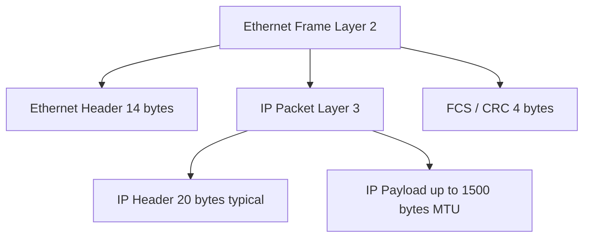

# Maximum Transmission Unit

### What is Maximum Transmission Unit? (MTU)

- MTU refers to the largest size of a frame that can be sent over a network
- The MTU is measured in **BYTES** and it dictates how much data can be transmitted in a single transaction/transmission
- Is the maximum load capacity for a single frame within a network

---

### Impact of MTU on network performance and efficiency

- Properly configuring an MTU on the network ensures optimal data packet and frame size transmission which enhances the network performance and stability
- An **MTU that is set too high** will experience packet loss and retransmission
- An **MTU that is set too low** will experience increased overhead and a slow network due to a decrease in efficiency.

---

### MTU Configuration *(depends on the type of network and traffic that we are trying to support)*

- Wired Ethernet network
    - Standard MTU size = 1500 bytes as it balances out the efficiency and compatibility requirements of many different network equipment and internet pathways without causing any issues
- Wireless network
    - Recommended to use a smaller MTU size due to instability and higher rates of error.
    - If configured with a larger MTU size it could lead to bigger packets needing to be transmitted which is why we configure a smaller MTU size for wireless nets
- VPN and PPPoE Connections
    - Needs to have a smaller MTU size due to encapsulation overhead as it adds extra headers to the packets which reduces the amount of space we have for the actual payload within the frame
    - Recommended size = 1400 - 1420 Bytes
- Jumbo Frames
    - Frames exceeding standard ethernet MTU size of 1500 bytes
    - Jumbo frames are typically configured with an MTU size of 9000 Bytes
    - Jumbo frame configurations are beneficial for high bandwidth applications like working in a storage area network, large file transfers, video streaming etc. etc.
    - **Some Challenges and considerations to take in for Jumbo frames**
        - Not all networking equipment supports a jumbo frame configuration, mismatched configuration can lead to drop packets and a drop in performance and efficiency
        - Potential for fragmentation to occur, if the jumbo frames runs into a device or network segment that has a smaller configured MTU size. The frame would need to be split up or fragmented into smaller size frames.
            - This basically offsets the benefit of even using a Jumbo frame as there will be increased latency and processing overhead on our network devices
        - Less troubleshooting support because our traditional troubleshooting tools often dont support the larger frame size used by Jumbo frame config
        - To effectively use the jumbo frame configuration we need to ensure consistent configuration on all networking devices like switches routers and network interface cards(NIC)

- Why MTU lives in L3

