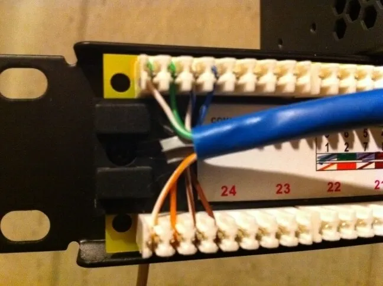
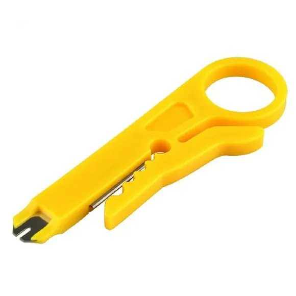
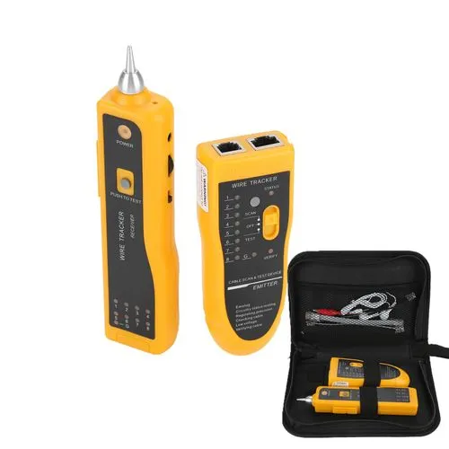

# Wiring and Testing a network

### Patch Panels

- Above is a punch down block of a patch panel and a punch down tool that we would use to punch down the individual wires on the physical patch panel
- Proper wiring is always going to state that we go from a switch to a patch panel and on the back of the patch panel the wiring is punchdown and from there it goes to a keystone which becomes a wall jack
    - The reason we go from a switch to a patch panel is to keep costs low
    - When moving wiring around its much easier to switch inputs on a patch panel rather than a switch. Also ensures that the component that gets the most wear and tear is the patch panel rather than the switch itself.

---

### Testing a network

Fox and hound also known as a toner probe

- Toner probes allow us to connect one end to a network jack and then use the probe end on wiring along the distribution path, the probe will start to make noise when it finds the correct cable
- The use case for a fox and hound / toner probe is to troubleshoot our distribution wiring and find breaks in the wiring and also to document wiring that may have unknown labelling

