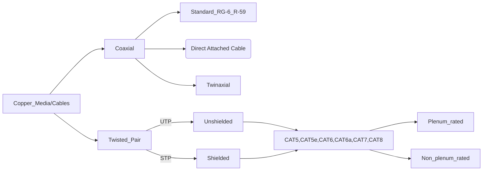

Media refers to the physical material that we use or is used to transmit data between devices

Most common types of media 

- Copper
- Fiber
- RF (radio frequency) waves
- 35 Copper Media
    
    # Copper Media
    
    ### Definition and core summary
    
    Copper media has been the default type of cable used in networks for decades which in-turn makes it an indispensable part of our network infrastructure
    
    ---
    
    ### IEEE 802.3 Standard
    
    - This standard defines the physical and data link layers, including MAC, for wired Ethernet networks
    - In simple terms this is what makes ethernet works — from how device talk to each other over cables to how data is structured and transmitted across LAN (commonly used in LAN)
    
    ### Twisted Pair Cable
    
    - Type of wiring in which 2 conductors of a single circuit are twisted together
    - Twisting these 2 conductors reduces electromagnetic interference and crosstalk from neighbouring cables
    - Unshielded Twisted Pair (UTP)
        - Composed of pairs of wires twisted together without additional shielding being aded to the cable
        - Makes this type of cable lightweight, flexible and cost effective
    - Shielded Twisted Pair (STP)
        - Includes shielding for better EMI protection
        - More expensive, bulkier and more difficult to install
    
    > UTP is good to use when the environment does not have a lot of EMI whereas STP is crucial for environments with a lot of EMI as the signal can get degraded over time.
    > 
    - Categories
        - CAT 5
            - 100 Mbps
            - 100 meters max
            - 100 Mhz frequency
            - 100 BASE-T (Fast Ethernet)
        - CAT 5e
            - 1000 Mbps /1Gbps
            - 100 meters max
            - 100 Mhz
            - 1000 BASE - T
        - CAT 6
            - 1 Gbps / 10 Gbps on 55 meters or less of cable length
            - 100 meters maximum
        - CAT 6a
            - 10 Gbps
            - 100 meters max
            - 500 Mhz
            - 10G BASE - T
        - CAT 7
            - 10 Gbps
            - 100 meters maximum
            - 600 Mhz
            - 10G BASE-T
        - CAT 8
            - 40 Gbps
            - 30 meters maximum
            - 2000 MHz/2 Ghz frequency

    ### Coaxial Cables

- These cables have been a fundamental part of networking and broadcasting for decades
- Consists of single copper conductor at its with insulating layer and a conductive shield

RG-6

- Used to support fast internet speeds in most residential installations
- standard for modern coaxial cable
- Supports up to 1 Gbps at up to around 300 meter distance

RG-59

- Older standard for coax  and is not commonly used anymore

Direct attached copper cable (DAC)

- Fixed assembly copper cabling for short distances
- Connects switches, routers or servers together and support up to 100 Gbps at short distances
- Favoured for its cost effectiveness and reduced power consumption when compared with fiver optic

**Twinaxial Cable**

- Is often a component of DAC assembly
- Commonly used in SFP+ and QSFP direct attached application between two routers or switches
- These cables are less susceptible to EMI as they are 2 insulated copper conductors
- Support 10Gbps at 100 meters, 25 Gbps, 40 Gbps and 100 Gbps at 7 meters

**Plenum Cables**

- Cables are designed with Fire-retardant plastic jackets made from materials such as PVC or FEP, suitable for HVAC circulation spaces where our cabling may be routed through
- The design of these cables are used to prevent flames from spreading and reduce the amount of smoke
- Plenum cabling meets the strict fire safety standard of NFPA and NEC.

## How we can categorize our cabling

### Basic Speeds and distance for each type of cable

CAT 5	100 Mbps @ 100 meters
CAT 5e	1 Gbps @ 100 meters
CAT 6	1 Gbps @ 100 meters; 10 Gbps @ 55 meters
CAT 6a	10 Gbps @ 100 meters
CAT 7	10 Gbps @ 100 meters
CAT 8	Up to 40 Gbps at about 30 meters
	
RG-6	1 Gbps at 300 meters
Twinaxial	10Gbps or more at 10 meters
DAC	100 Gbps at 15 meters (active cables), 100 Gbps at 7 meters (passive cables)