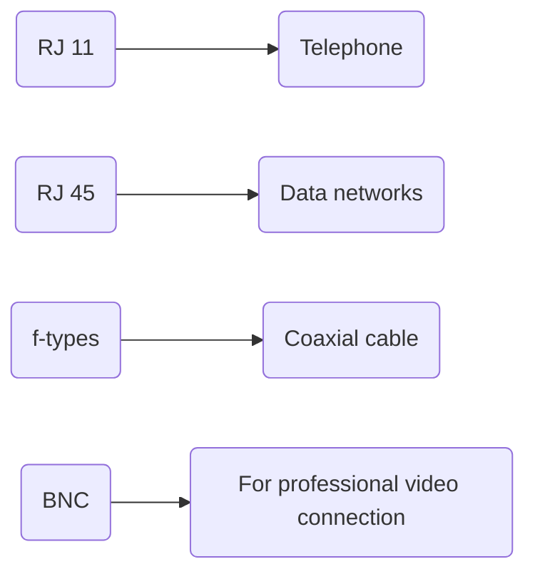

# Copper Network Connections

### Registered Jack (RJ-X)

- A standard telecommunication network Interface for connecting voice and data equipment to a service provided by a local exchange carrier or long-distance carrier
- The X in the name is just a placeholder for the specific standard number like RJ-11 or RJ-45
- RJ-11 and RJ-45
    - Are crucial for voice and data networks
    - Uses twisted pair cables

---

### Radio Guide (RG-X)

- Series of coaxial cables, used in high speed internet, television and radio connections/communications.
- Commonly used cables as a network tech
    - RG-6 for cable TV
    - RG 59 for older applications

---

### Common Connector types

- RJ-11
    - Standard for telephone wiring
    - Has a 6 position 2 conductor configuration (6P2C)
    - Smaller in size which makes it ideal for telephone connection
    - Not suitable for High speed data transmission
- RJ-45
    - Standard for data networks that utilize copper cables to create our ethernet network
    - 8 Position 8 conductors config 8P8C
    - Widely used for computers, switches, routers in local area networks
    - Supports high speed wired data transfers
    - Compatible with CAT 5 to CAT 8 cables — with the bandwidth capability going up as the CAT goes up
- F-Type Connector
    - Screw on connector used with RG-6 and RG-59 coaxial cables which is a standard for CATV and satellite connections and also can be used for cable internet connections
    - RG-6 is a standard for coaxial cables and primary used in residential and commercial settings. RG-6 has a better shielding and a better gauge on the physical cabling than the RG-59
- BNC Connector (Bayonet Neill Concelman)
    - Coxial connector with a secure bayonet locking mechanism
    - Used with RG-6 or RG-59 coaxial cables
    - Push and twist style connector (SDI Cable)
    - Common in professional video connections and radio frequency applications

---

### Application specifics

- **RJ-11** For voice-based communication networks (telephones)
- **RJ-45** For data devices in data networks (Computers, Printers, Switches and routers)
- **F-Types** For coaxial cables in CATV, Satellite and cable internet connections
- **BNC(SDI)** is used for professional video connections and RF applications

